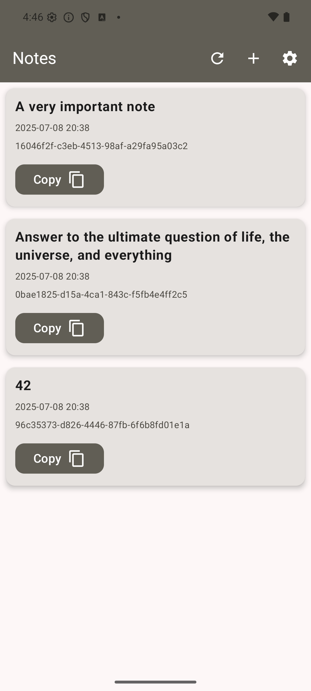
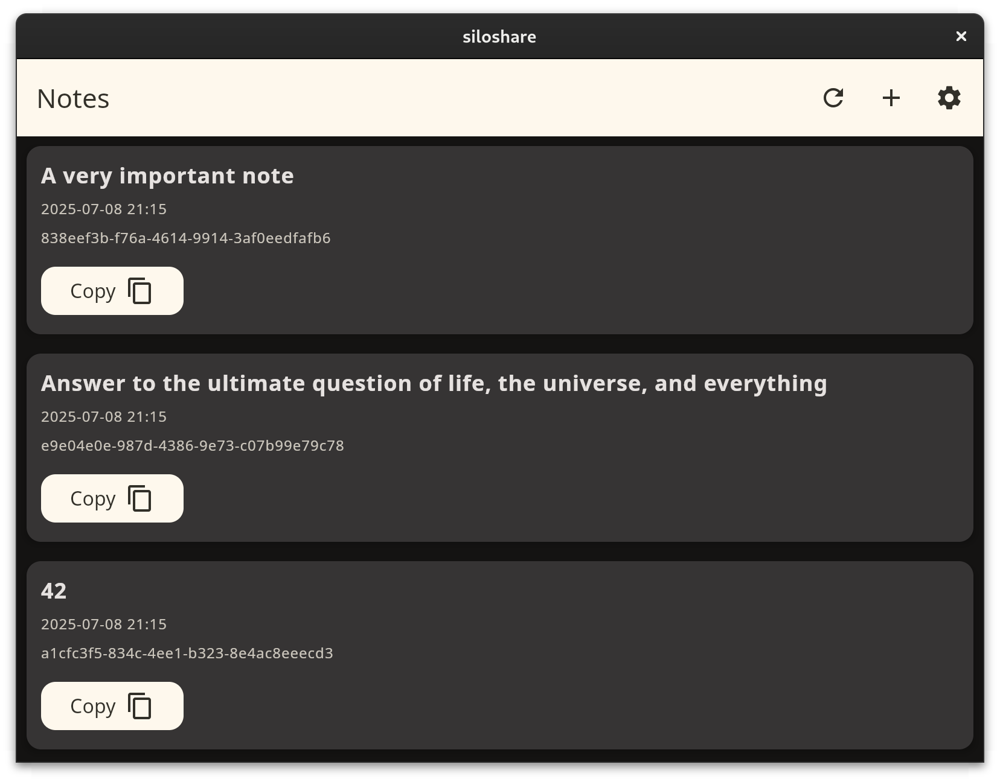

# siloshare client
The name siloshare stands for `simple local share`. This is a Kotlin Multiplatform client for the [siloshare server](https://github.com/dbaelz/siloshare).
The project targets Android, iOS, Web, Desktop. It uses Compose Multiplatform to share the UI across all platforms.

## Download
The app is available on the [Google Play Store](https://play.google.com/store/apps/details?id=de.dbaelz.siloshare).

## Features
- Fetch notes from the siloshare server and display them in a list
- Settings screen to configure the server URL and basic authentication

## Project structure
* `/composeApp` is for code that will be shared across your Compose Multiplatform applications.
  It contains several subfolders:
  - `commonMain` is for code that’s common for all targets.
  - Other folders are for Kotlin code that will be compiled for only the platform indicated in the folder name.
    For example, if you want to use Apple’s CoreCrypto for the iOS part of your Kotlin app,
    `iosMain` would be the right folder for such calls.

* `/iosApp` contains iOS applications. Even if you’re sharing your UI with Compose Multiplatform, 
  you need this entry point for your iOS app. This is also where you should add SwiftUI code for your project.

## Screenshots

| Platform | Notes                                        | Add note                                             | Settings                                             |                                                          |
|----------|----------------------------------------------|------------------------------------------------------|------------------------------------------------------|----------------------------------------------------------|
| Android  |  |    |    |    |
| Desktop  |  |  |  |  |

## Contribution
Feel free to contribute via pull requests.

## License
The project is licensed by the [Apache 2 license](LICENSE).